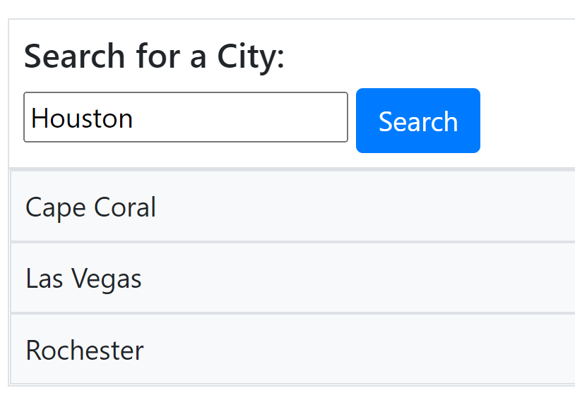
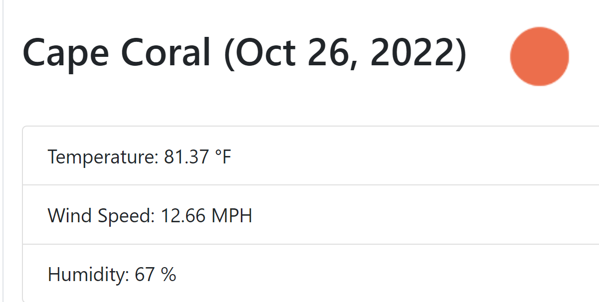
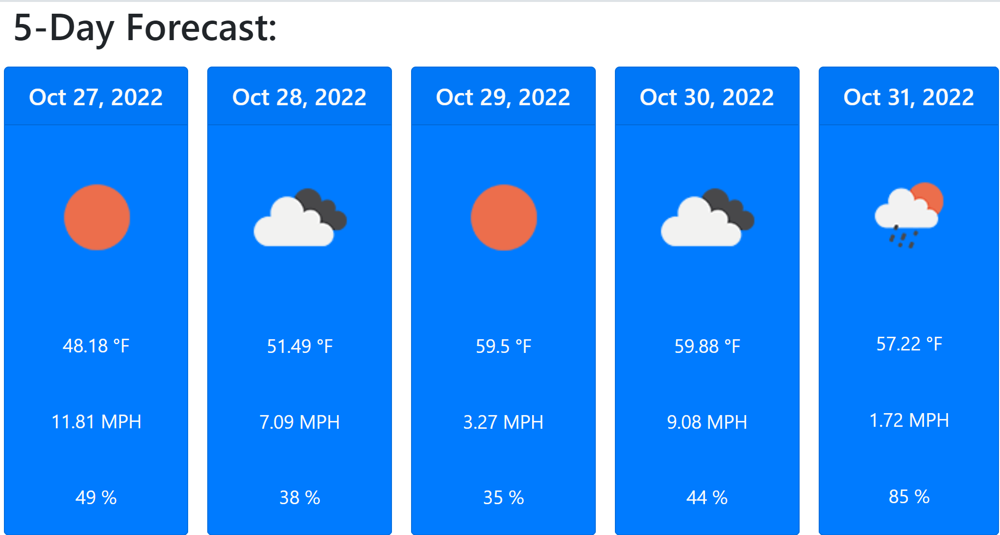

# personal-weather-dashboard
An up to date 5 day weather outlook for multiple cities.

## Description

USER STORY 

AS A traveler 
I WANT to see the weather outlook for multiple cities 
SO THAT I can plan a trip accordingly 

***

ACCEPTANCE CRITERIA 

GIVEN a weather dashboard with form inputs 
WHEN I search for a city 
THEN I am presented with current and future conditions for that city and that city is added to the search history 
WHEN I view current weather conditions for that city 
THEN I am presented with the city name, the date, an icon representation of weather conditions, the temperature, the humidity, and the wind speed 
WHEN I view future weather conditions for that city 
THEN I am presented with a 5-day forecast that displays the date, an icon representation of weather conditions, the temperature, the wind speed, and the humidity 
WHEN I click on a city in the search history 
THEN I am again presented with current and future conditions for that city 

## Installation

N/A

## Usage 

Link https://labeutler.github.io/personal-weather-dashboard/

I am presented with current and future conditions for that city and that city is added to the search history 

I am presented with the city name, the date, an icon representation of weather conditions, the temperature, the humidity, and the wind speed  

I am presented with a 5-day forecast that displays the date, an icon representation of weather conditions, the temperature, the wind speed, and the humidity 

I am again presented with current and future conditions for that city  

## Credits

N/A

## License

MIT License
https://choosealicense.com/licenses/mit/

